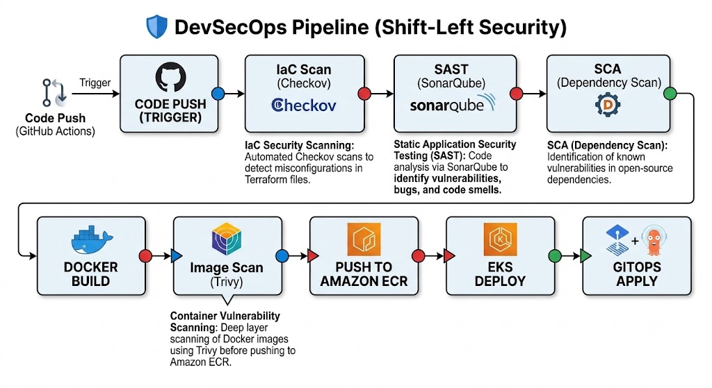
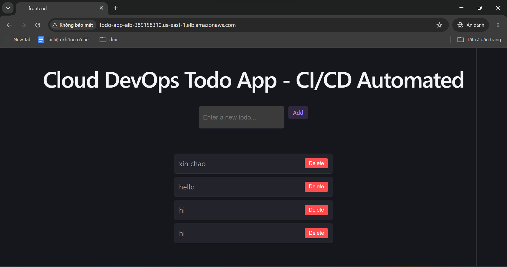
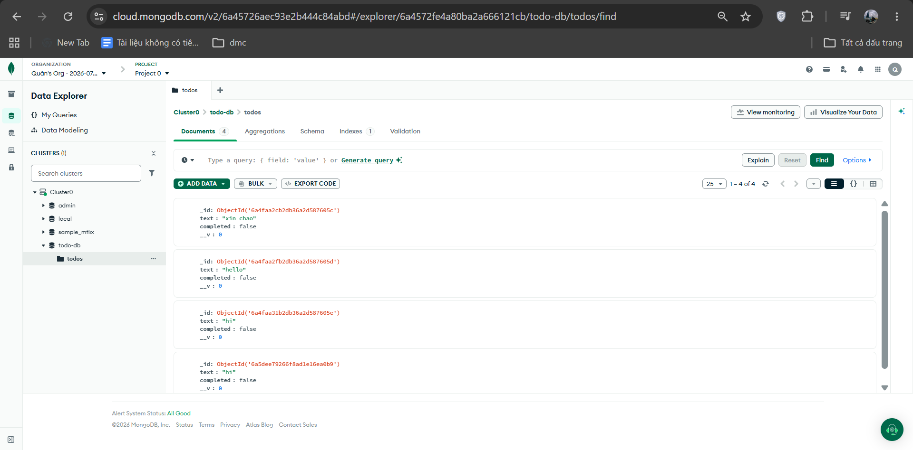
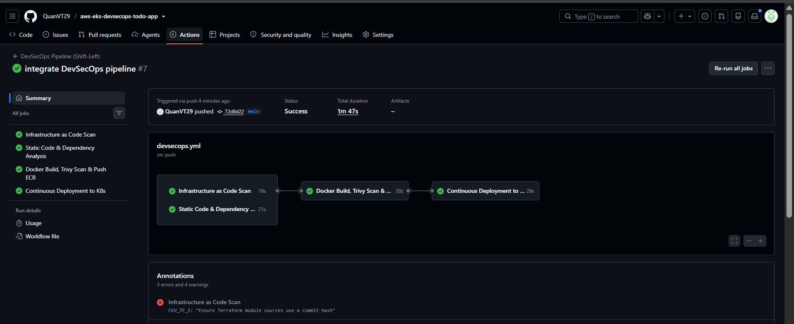
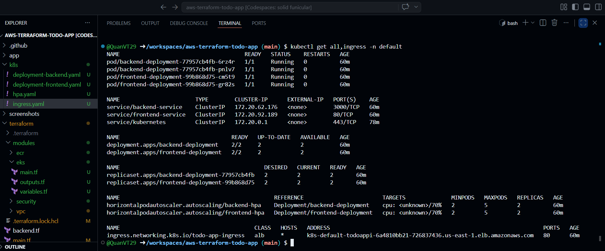

# 🚀 Cloud-Native DevSecOps Todo Application on AWS EKS

This project demonstrates the design, deployment, and automation of a cloud-native, DevSecOps-aligned MERN Stack web application deployed on AWS EKS (Elastic Kubernetes Service). The entire infrastructure is managed as code (IaC) via Terraform and orchestrated using automated GitHub Actions CI/CD pipelines integrated with automated security scanning tools.

---

<br>
<br>

## 🏗️ Architecture Overview

The project implements a multi-layered cloud security architecture designed for High Availability (HA), dynamic auto-scaling, and strict network isolation.


---

<br>


## 🛡️ Security & Automation Pipeline (DevSecOps CI/CD)

The system enforces a **Shift-Left Security** methodology through two distinct automated GitHub Actions workflows:


- Infrastructure as Code (IaC) Security Scanning: Automatically inspects Terraform configurations for misclassifications and security vulnerabilities using Checkov.

- Static Application Security Testing (SAST): Syntactically analyzes Frontend and Backend source code utilizing SonarQube to identify bugs, vulnerabilities, and code smells.

- Container Image Vulnerability Scanning: Utilizes Trivy to perform deep layer-by-layer scanning of Docker images prior to pushing them to AWS ECR, preventing deprecated or vulnerable packages from reaching production.



<br>

## 📂 Project Structure

```text
aws-terraform-todo-app/
├── .github/
│   └── workflows/
│       ├── terraform.yml          # Terraform IaC Pipeline (Validate, Plan, Apply)
│       └── app-deploy.yml         # DevSecOps Pipeline (Scan, Build, Push, Deploy)
│
├── app/
│   ├── backend/                   # Node.js API + Dockerfile
│   └── frontend/                  # React.js + Nginx + Dockerfile
│
├── terraform/
│   ├── modules/                   
│   │   ├── vpc/                   # Multi-AZ Network Infrastructure & NAT Gateways
│   │   ├── eks/                   # Amazon EKS Control Plane & Node Groups
│   │   ├── ecr/                   # Container Registries for Frontend & Backend Images
│   │   └── security/              # IAM Roles & Fine-grained Security Groups
│   │
│   ├── backend.tf                 # S3 + DynamoDB Remote State & State Locking
│   └── main.tf                    # Root Infrastructure
│
└── k8s/
    ├── namespace.yaml             # Isolated Kubernetes Environment Definition
    ├── deployment-backend.yaml    # Backend Pods & MongoDB Connection Config
    ├── deployment-frontend.yaml   # Frontend Nginx Pods Configuration
    ├── ingress.yaml               # AWS ALB Ingress Controller Routing (Routing to / & /api)
    └── hpa.yaml                   # Horizontal Pod Autoscaler (Auto-scaling by CPU/RAM)
```


<br>


## 🛠 Tech Stack

| Layer | Technologies |
|--------|--------------|
|  Cloud Infrastructure | AWS (VPC, EKS, IAM, ECR, S3, DynamoDB) |
|  Infrastructure as Code | Terraform v1.10+ |
|  Containerization | Docker |
|  Kubernetes | Amazon EKS (v1.30+) |
|  Database | MongoDB Atlas |
|  DevSecOps | Trivy, Checkov, SonarQube |
|  CI/CD | GitHub Actions |
|  Frontend | React.js, Nginx |
|  Backend | Node.js, Express.js |


<br>

## 🚀 Deployment Guide

Step 1: Remote State & Backend Initialization
Ensure the AWS CLI is configured locally and Terraform is installed. Initialize an S3 Bucket and a DynamoDB table via the AWS Console to handle state locking and storage securely.

Step 2: Provision Infrastructure via Terraform

```
cd terraform

terraform init

terraform plan

terraform apply -auto-approve
```

Step 3: Configure Kubernetes Cluster Context

Once the Terraform execution completes, fetch the cluster authentication context to interact with your EKS cluster using kubectl:

```text
aws eks update-kubeconfig --region us-east-1 --name todo-app-cluster
```

Step 4: Deploy Manifests to the Cluster

```text
cd ../k8s
kubectl apply -f .
```

<br>

## 📊 Screenshots & Verification

The following verification metrics confirm system stability and pipeline compliance post-automation:

### 1. Dynamic Web UI Accessible via Ingress
   


<br>


### 2. Real-Time Data Persistence on MongoDB Atlas



<br>


### 3. Successful DevSecOps Pipeline Status



<br>


### 4. Cluster Runtime Status (Kubernetes Workloads)

 


<br>

## 🧹 Clean Up

To prevent unexpected billing charges on your AWS account, tear down all active cloud resources immediately after testing:

```text
kubectl delete -f k8s/
cd terraform
terraform destroy -auto-approve
```

<br>

## 📝 Author

QuanVT29 – Information Assurance Student @ FPT University & Cloud DevOps Engineer Fresher.

Connect with me on GitHub or https://www.linkedin.com/in/qu%C3%A2n-vt-243752337/ 
