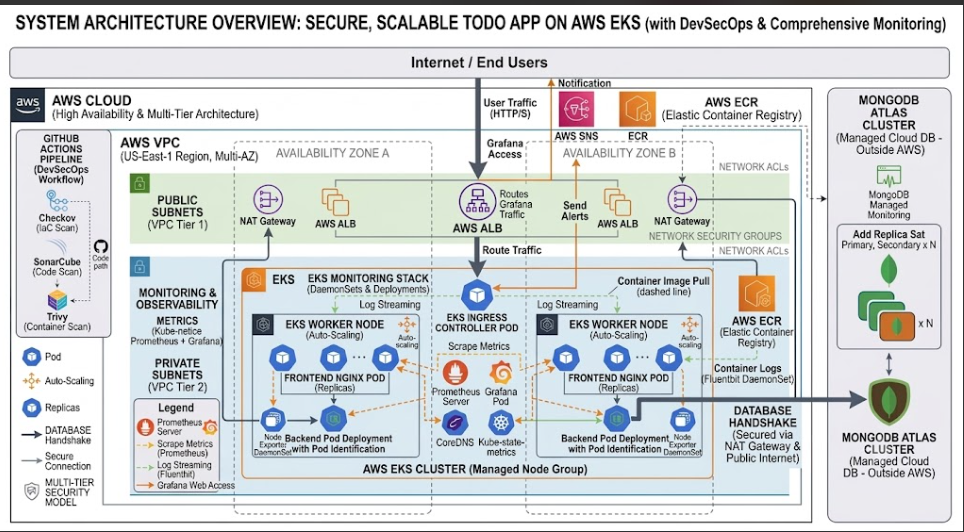
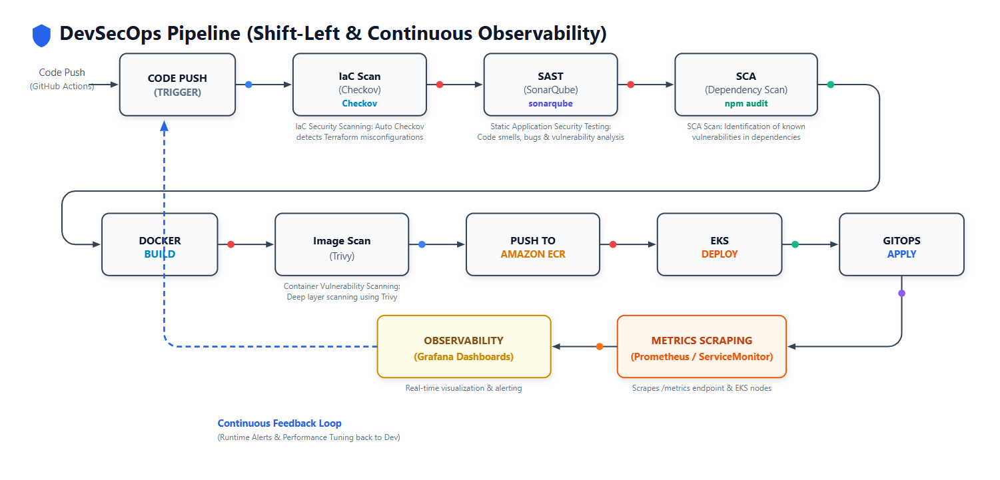
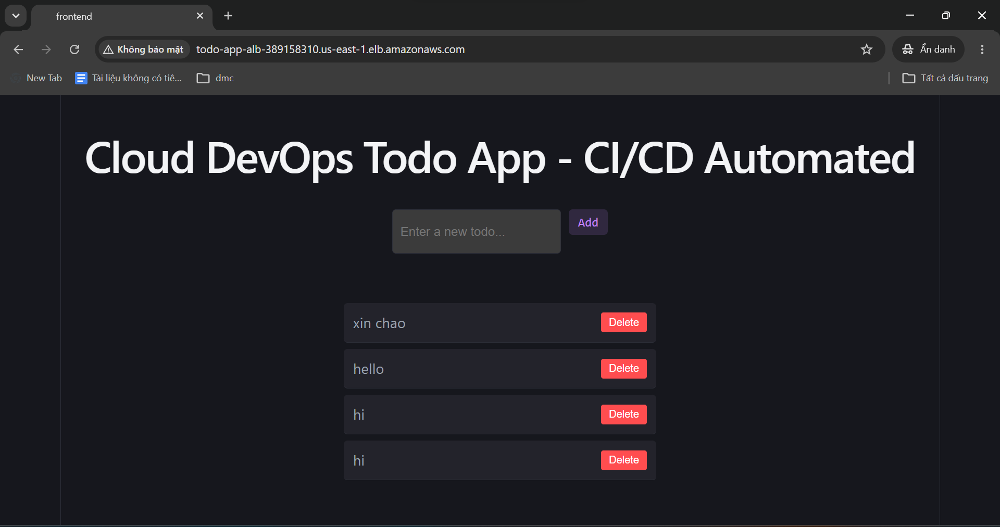
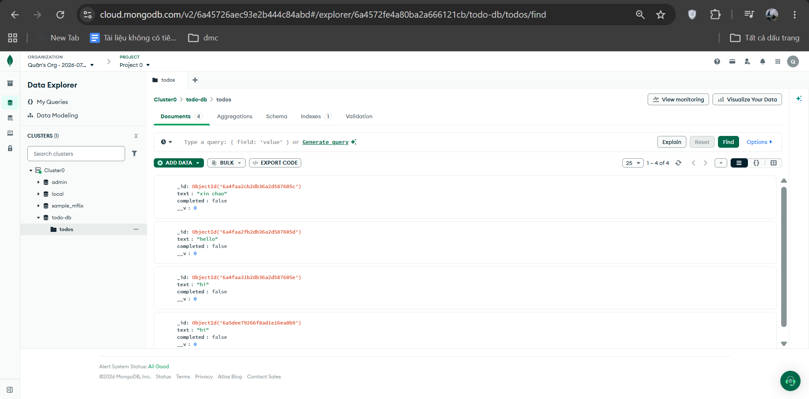
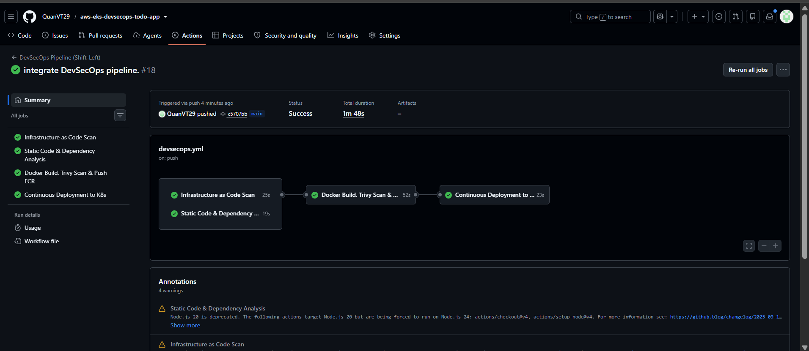
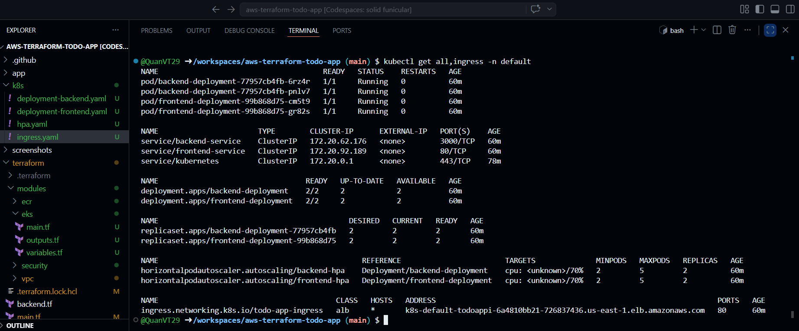
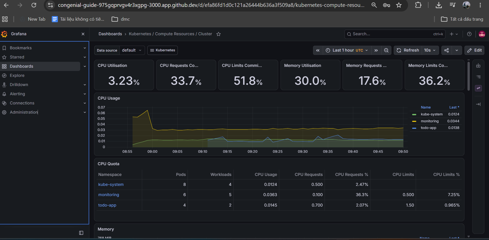

# 🚀 Cloud-Native DevSecOps Todo Application on AWS EKS

This project demonstrates the design, deployment, and automation of a production-grade, DevSecOps-aligned full-stack web application hosted on AWS EKS (Elastic Kubernetes Service). The entire infrastructure is provisioned as code (IaC) using Terraform, automated via GitHub Actions CI/CD pipelines with automated Shift-Left security scanners (Checkov, SonarQube, npm audit, Trivy), and continuously monitored using kube-prometheus-stack (Prometheus & Grafana).

---

<br>
<br>

## 🏗️ Architecture Overview

The project implements a multi-layered cloud security architecture designed for High Availability (HA), dynamic auto-scaling, and strict network isolation.



---

<br>


## 🛡️ Security & Automation Pipeline (DevSecOps CI/CD)

The system enforces a **Shift-Left Security** methodology through two distinct automated GitHub Actions workflows:


- Infrastructure as Code (IaC) Security Scanning: Automatically inspects Terraform configurations for misclassifications and security vulnerabilities using Checkov.

- Static Application Security Testing (SAST): Syntactically analyzes Frontend and Backend source code utilizing SonarQube to identify bugs, vulnerabilities, and code smells.

- Container Image Vulnerability Scanning: Utilizes Trivy to perform deep layer-by-layer scanning of Docker images prior to pushing them to AWS ECR, preventing deprecated or vulnerable packages from reaching production.



<br>

## 📂 Project Structure

```text
aws-eks-devsecops-todo-app/
├── .github/
│   └── workflows/
│       ├── terraform.yml          # Terraform CI/CD: fmt, init, validate, plan, apply
│       └── devsecops.yml          # Shift-Left Security Pipeline: Checkov, SAST, Trivy, Deploy
│
├── app/
│   ├── backend/                   # Node.js Express API + prom-client metrics
│   │   ├── src/
│   │   │   └── index.js           # REST API & /metrics endpoint
│   │   ├── Dockerfile             # Hardened Alpine-based container
│   │   └── package.json
│   └── frontend/                  # React.js client
│       ├── nginx/
│       │   └── default.conf       # Reverse proxy configuration
│       ├── Dockerfile             # Multi-stage build container
│       └── src/
│
├── terraform/
│   ├── modules/                   
│   │   ├── vpc/                   # Multi-AZ VPC, subnets, NAT Gateway
│   │   ├── eks/                   # EKS Cluster (v1.31) & Managed Node Groups
│   │   ├── ecr/                   # KMS-encrypted ECR repositories
│   │   └── security/              # IAM Policies & IRSA Role for AWS Load Balancer Controller
│   ├── backend.tf                 # Remote S3 state backend configuration
│   ├── main.tf                    # Root orchestration module & Kubernetes Secret creation
│   ├── outputs.tf
│   ├── providers.tf
│   └── variables.tf
│
├── k8s/
│   ├── namespace.yaml             # todo-app namespace definition
│   ├── deployment-backend.yaml    # Backend pods deployment & ServiceMonitor annotations
│   ├── deployment-frontend.yaml   # Frontend deployment & Service configuration
│   ├── ingress.yaml               # Ingress resource for AWS ALB
│   └── hpa.yaml                   # HorizontalPodAutoscaler definitions
│
├── monitoring/
│   └── values.yaml                # Custom Helm values for kube-prometheus-stack
│
└── screenshots/                   # Verification images for portfolio evidence
```


<br>


## 🛠 Tech Stack

| Layer | Technologies |
|--------|--------------|
|  Cloud Infrastructure | AWS (VPC, EKS, IAM, ECR, S3, DynamoDB) |
|  Infrastructure as Code | Terraform v1.10+ |
|  Containerization | Docker |
|  Kubernetes | Amazon EKS (v1.30+) |
|  Database | MongoDB Atlas |
|  Observability & Monitoring | Prometheus, Grafana, Prom-Client, Helm |
|  DevSecOps | Trivy, Checkov, SonarQube |
|  CI/CD | GitHub Actions |
|  Frontend | React.js, Nginx |
|  Backend | Node.js, Express.js |


<br>

## 🚀 Deployment Guide

### Option 1: Production Deployment (Automated via GitHub Actions)

1. Infrastructure & Remote Backend: Pre-configured with S3 Bucket & DynamoDB for Terraform State locking.
  
2.  Trigger Deployment: Go to GitHub Repository -> Actions -> Select DevSecOps Pipeline (Shift-Left) -> Click Run workflow.

3.  Automated Pipeline Execution:
   
- Security Scans: Checkov (IaC) & Trivy (Container Images) validate code security.
  
- Provisioning: Automated terraform apply provisions VPC and EKS.
  
- Deployment: Manifests in k8s/ are applied automatically via kubectl.


<br>

### Option 2: Local Testing & Troubleshooting (Manual Fallback

Step 1: Remote State & Backend Initialization
Ensure the AWS CLI is configured locally and Terraform is installed. Initialize an S3 Bucket and a DynamoDB table via the AWS Console to handle state locking and storage securely.

Step 2: Provision Infrastructure via Terraform

```
cd terraform
cat <<EOF > terraform.tfvars
mongo_uri = "your-mongodb-connection-string"
EOF

terraform init
terraform apply -auto-approve
```

Step 3: Configure Cluster Access & Install ALB Controller


```text
aws eks update-kubeconfig --region us-east-1 --name todo-app-cluster

ROLE_ARN=$(terraform output -raw alb_controller_role_arn)
VPC_ID=$(terraform output -raw vpc_id)

helm repo add eks https://aws.github.io/eks-charts
helm repo update

helm install aws-load-balancer-controller eks/aws-load-balancer-controller \
  -n kube-system \
  --set clusterName=todo-app-cluster \
  --set serviceAccount.create=true \
  --set serviceAccount.name=aws-load-balancer-controller \
  --set serviceAccount.annotations."eks\.amazonaws\.com/role-arn"=$ROLE_ARN \
  --set region=us-east-1 \
  --set vpcId=$VPC_ID
```

Step 4: Deploy Application Workloads

```text
cd ../k8s
kubectl apply -f .
```


Step 5: Deploy the Prometheus & Grafana Monitoring Stack

```text
cd ..
helm repo add prometheus-community https://prometheus-community.github.io/helm-charts
helm repo update

helm install monitoring-stack prometheus-community/kube-prometheus-stack \
  --namespace monitoring \
  --create-namespace \
  -f monitoring/values.yaml
```
<br>


## 🔍 Verification & Access

### 1. Application Access

Find the public DNS hostname of the AWS Application Load Balancer:
```
kubectl get ingress -n todo-app
```

Access the application by pasting the ADDRESS value into any browser:

http://<k8s-todoapp-ingress-xxxx.us-east-1.elb.amazonaws.com>


### 2. Grafana Dashboard Access

Port-forward Grafana to your local workstation:
```
kubectl port-forward -n monitoring svc/monitoring-stack-grafana 3000:80
```
URL: http://localhost:3000

Username: admin

Password: Retrieve the generated secret:

```
kubectl get secret --namespace monitoring monitoring-stack-grafana -o jsonpath="{.data.admin-password}" | base64 --decode; echo
```

<br>

## 📊 Screenshots & Verification

The following verification metrics confirm system stability and pipeline compliance post-automation:

### 1. Dynamic Web UI Accessible via Ingress
   


<br>


### 2. Real-Time Data Persistence on MongoDB Atlas



<br>


### 3. Successful DevSecOps Pipeline Status



<br>


### 4. Cluster Runtime Status (Kubernetes Workloads)

 

### 5. Grafana Cluster Metrics & Application Telemetry




<br>

## 🧹 Clean Up

To prevent unexpected billing charges on your AWS account, tear down all active cloud resources immediately after testing:

```text
kubectl delete -f k8s/
cd terraform
terraform destroy -auto-approve
```

<br>

## 📝 Author

QuanVT29 – Information Assurance Student @ FPT University & Cloud DevOps Engineer Fresher.

Connect with me on GitHub or https://www.linkedin.com/in/qu%C3%A2n-vt-243752337/ 
